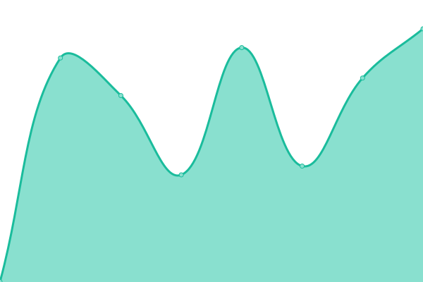
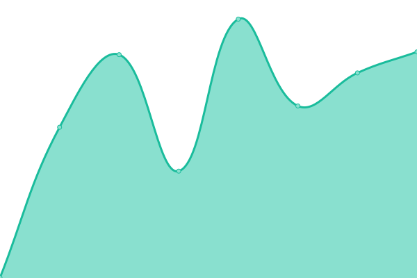
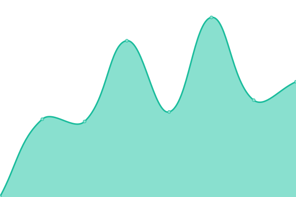

# [📈 Live Status](https://einsteintoolkit.github.io/uptime): <!--live status--> **🟩 All systems operational**

This repository contains the open-source uptime monitor and status page for [Einstein Toolkit](http://einsteintoolkit.org/), powered by [Upptime](https://github.com/upptime/upptime).

With [Upptime](https://upptime.js.org), you can get your own unlimited and free uptime monitor and status page, powered entirely by a GitHub repository. We use [Issues](https://github.com/einsteintoolkit/uptime/issues) as incident reports, [Actions](https://github.com/einsteintoolkit/uptime/actions) as uptime monitors, and [Pages](https://einsteintoolkit.github.io/uptime) for the status page.

<!--start: status pages-->
<!-- This summary is generated by Upptime (https://github.com/upptime/upptime) -->
<!-- Do not edit this manually, your changes will be overwritten -->
<!-- prettier-ignore -->
| URL | Status | History | Response Time | Uptime |
| --- | ------ | ------- | ------------- | ------ |
|  [EinsteinToolkit website](https://www.einsteintoolkit.org) | 🟩 Up | [einstein-toolkit-website.yml](https://github.com/EinsteinToolkit/uptime/commits/HEAD/history/einstein-toolkit-website.yml) | 

 633ms
     
 | 

<a href="https://einsteintoolkit.github.io/uptime/history/einstein-toolkit-website">100.00%</a>
    

|  [CactusCode website](https://www.cactuscode.org) | 🟩 Up | [cactus-code-website.yml](https://github.com/EinsteinToolkit/uptime/commits/HEAD/history/cactus-code-website.yml) | 

 255ms
     
 | 

<a href="https://einsteintoolkit.github.io/uptime/history/cactus-code-website">100.00%</a>
    

|  [EinsteinToolkit wiki](https://docs.einsteintoolkit.org) | 🟩 Up | [einstein-toolkit-wiki.yml](https://github.com/EinsteinToolkit/uptime/commits/HEAD/history/einstein-toolkit-wiki.yml) | 

 674ms
     
 | 

<a href="https://einsteintoolkit.github.io/uptime/history/einstein-toolkit-wiki">100.00%</a>
    

|  [Tutorial server](https://etk.cct.lsu.edu) | 🟩 Up | [tutorial-server.yml](https://github.com/EinsteinToolkit/uptime/commits/HEAD/history/tutorial-server.yml) | 

 685ms
     
 | 

<a href="https://einsteintoolkit.github.io/uptime/history/tutorial-server">100.00%</a>
    

|  [Cactus SVN server](http://svn.cactuscode.org) | 🟩 Up | [cactus-svn-server.yml](https://github.com/EinsteinToolkit/uptime/commits/HEAD/history/cactus-svn-server.yml) | 

 619ms
     
 | 

<a href="https://einsteintoolkit.github.io/uptime/history/cactus-svn-server">100.00%</a>
    

|  [EinsteinToolkit SVN server](http://svn.einsteintoolkit.org) | 🟩 Up | [einstein-toolkit-svn-server.yml](https://github.com/EinsteinToolkit/uptime/commits/HEAD/history/einstein-toolkit-svn-server.yml) | 

 386ms
     
 | 

<a href="https://einsteintoolkit.github.io/uptime/history/einstein-toolkit-svn-server">100.00%</a>
    

|  [EinsteinToolkit mailing list server](https://mail.einsteintoolkit.org) | 🟩 Up | [einstein-toolkit-mailing-list-server.yml](https://github.com/EinsteinToolkit/uptime/commits/HEAD/history/einstein-toolkit-mailing-list-server.yml) | 

 390ms
     
 | 

<a href="https://einsteintoolkit.github.io/uptime/history/einstein-toolkit-mailing-list-server">100.00%</a>
    

<!--end: status pages-->

[**Visit our status website →**](https://einsteintoolkit.github.io/uptime)

## 📄 License

- Powered by: [Upptime](https://github.com/upptime/upptime)
- Code: [MIT](./LICENSE) © [Einstein Toolkit](http://einsteintoolkit.org/)
- Data in the `./history` directory: [Open Database License](https://opendatacommons.org/licenses/odbl/1-0/)
